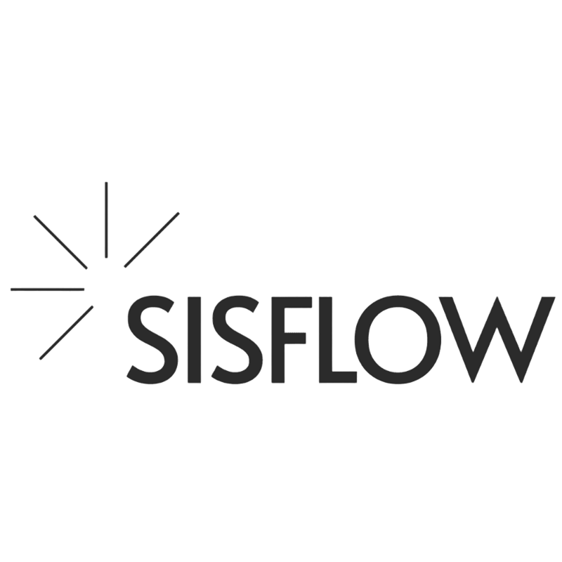

<p align="center">
  
</p>

# SisFlow Backend

Backend do SisFlow, uma plataforma multi-tenant para operação de service desk com autenticação JWT, controle de acesso por hierarquia, integrações externas e trilha de auditoria.

## Visão Geral

- API principal em Spring Boot para gestão de tickets, clientes, projetos, SLA, permissões e tenants.
- Serviços auxiliares para autenticação e notificações em uma estrutura preparada para evolução modular.
- Persistência com PostgreSQL e Flyway, além de Redis para cache e rate limiting.

## Principais Capacidades

- Multi-tenancy com isolamento por tenant.
- Autenticação JWT com refresh token.
- Autorização por papéis, permissões e nível hierárquico.
- Gestão completa de tickets, interações, anexos e homologação.
- Integração com GitHub para automações de fluxo.
- Upload seguro de arquivos e trilha de auditoria.

## Arquitetura

O backend está organizado em uma aplicação principal e dois serviços preparados para evolução independente:

- `sisflow`:
  núcleo da plataforma, APIs de negócio, tenancy, tickets, autorização, auditoria e integrações.
- `auth-service`:
  serviço dedicado a autenticação, tokens, confirmação de e-mail e rate limiting de login.
- `notification-service`:
  processamento assíncrono de notificações por e-mail via mensageria.

Fluxo macro:

1. O cliente autentica no `auth-service` ou na aplicação principal, conforme o cenário de implantação.
2. A API principal processa operações de negócio e publica eventos de notificação.
3. O `notification-service` consome filas e envia e-mails desacoplados da requisição principal.

## Stack

- Java 17
- Spring Boot
- Spring Security
- Spring Data JPA
- PostgreSQL
- Flyway
- Redis
- RabbitMQ

## Infraestrutura

- `PostgreSQL`:
  persistência transacional da aplicação, incluindo tenants, tickets, auditoria e controle de acesso.
- `Redis`:
  cache distribuído, rate limiting e controle de tentativas de autenticação.
- `RabbitMQ`:
  mensageria entre autenticação e notificações, desacoplando o envio de e-mails do fluxo principal.
- `Nginx`:
  reverse proxy à frente da aplicação para roteamento, TLS e encaminhamento controlado de headers confiáveis.

## Estrutura

```text
.
├── src/                           aplicação principal
├── services/auth-service/         serviço dedicado de autenticação
├── services/notification-service/ serviço de notificações
├── docs/                          documentação técnica e de segurança
├── scripts/sql/                   utilitários operacionais de banco
└── assets/                        identidade visual do repositório
```

## Microserviços

| Componente | Responsabilidade | Stack |
| --- | --- | --- |
| `sisflow` | operação do service desk, tenancy, tickets, RBAC, integrações | Spring Boot, JPA, PostgreSQL, Redis |
| `auth-service` | autenticação, JWT, refresh token, confirmação de e-mail | Spring Boot, JPA, Redis, RabbitMQ |
| `notification-service` | envio assíncrono de notificações | Spring Boot, RabbitMQ, Resend |

## Execução Local

```bash
mvn clean test
mvn spring-boot:run
```

Variáveis esperadas no ambiente:

- `SPRING_DATASOURCE_URL`
- `SPRING_DATASOURCE_USERNAME`
- `SPRING_DATASOURCE_PASSWORD`
- `JWT_SECRET`
- `APP_BASE_URL`

## Container

Build principal:

```bash
docker build -t sisflow-backend .
docker run --rm -p 8080:8080 sisflow-backend
```

## Documentação

- Visão geral técnica: [docs/README.md](docs/README.md)
- Arquitetura: [docs/microservices-ddd-architecture.md](docs/microservices-ddd-architecture.md)
- Segurança: [docs/security](docs/security)
- Utilitários SQL: [scripts/sql/README.md](scripts/sql/README.md)
